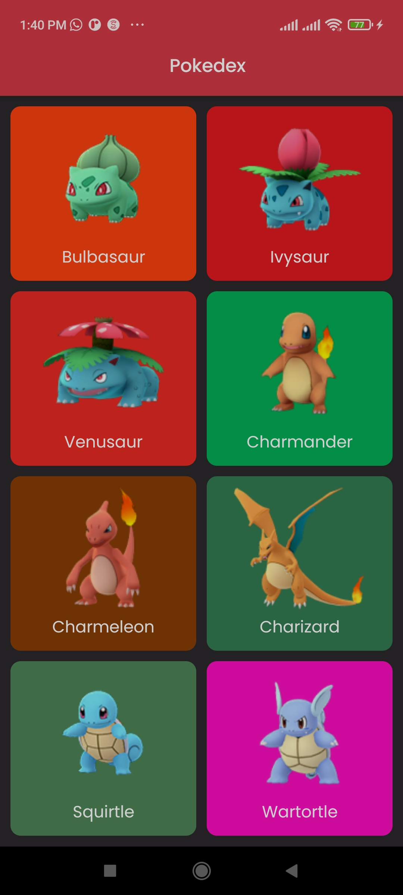
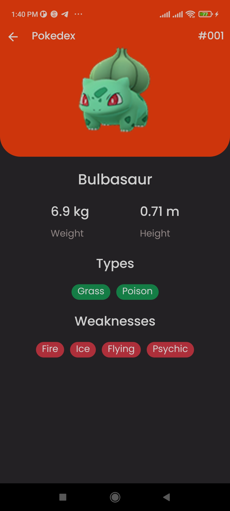

# ComposePokedex App

This is a small app but I tried to structure it following the clean architecture pattern - data, domain, presentation

Home Screen           |  Detail Screen
:-------------------------:|:-------------------------:
  |  